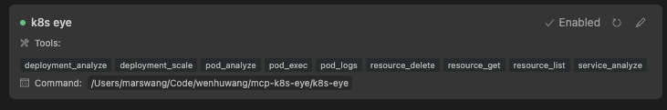

## mcp-k8s-eye

mcp-k8s-eye is a tool that can manage kubernetes cluster and analyze workload status.

## Features

### Core Kubernetes Operations
- [x] Connect to a Kubernetes cluster
- [x] **Generic Kubernetes Resources** management capabilities
  - Support all navtie resources: Pod, Deployment, Service, StatefulSet, Ingress...
  - Support CustomResourceDefinition resources
  - Operations include: list, get, create, update, delete
- [x] Pod management capabilities (exec, logs)
- [x] Deployment management capabilities (scale)
- [x] Describe Kubernetes resources
- [ ] Explain Kubernetes resources


### Diagnostics
- [x] Pod diagnostics (analyze pod status, container status, pod resource utilization)
- [x] Service diagnostics (analyze service selector configuration, not ready endpoints, events)
- [x] Deployment diagnostics (analyze available replicas)
- [x] StatefulSet diagnostics (analyze statefulset service if exists, pvc if exists, available replicas)
- [x] CronJob diagnostics (analyze cronjob schedule, starting deadline, last schedule time)
- [x] Ingress diagnostics (analyze ingress class configuration, related services, tls secrets)
- [x] NetworkPolicy diagnostics (analyze networkpolicy configuration, affected pods)
- [x] ValidatingWebhook diagnostics (analyze webhook configuration, referenced services and pods)
- [x] MutatingWebhook diagnostics (analyze webhook configuration, referenced services and pods)
- [x] Node diagnostics (analyze node conditions)
- [ ] Cluster diagnostics and troubleshooting 

### Monitoring
- [x] Pod, Deployment, ReplicaSet, StatefulSet, DaemonSet workload resource usage (cpu, memory)
- [ ] Node capacity, utilization (cpu, memory)
- [ ] Cluster capacity, utilization (cpu, memory)

### Advanced Features
- [x] Multiple transport protocols support (Stdio, SSE)
- [x] Support multiple AI Clients


## Tools Usage

### Resource Operation Tools
- `resource_get`: Get detailed resource information about a specific resource in a namespace
- `resource_list`: List detailed resource information about all resources in a namespace 
- `resource_create_or_update`: Create or update a resource in a namespace
- `resource_delete`: Delete a resource in a namespace
- `resource_describe`: Describe a resource detailed information in a namespace
- `deployment_scale`: Scale a deployment in a namespace
- `pod_exec`: Execute a command in a pod in a namespace`
- `pod_logs`: Get logs from a pod in a namespace

###  Diagnostics Tools
- `pod_analyze`: Diagnose all pods in a namespace
- `deployment_analyze`: Diagnose all deployments in a namespace
- `statefulset_analyze`: Diagnose all statefulsets in a namespace
- `service_analyze`: Diagnose all services in a namespace
- `cronjob_analyze`: Diagnose all cronjobs in a namespace
- `ingress_analyze`: Diagnose all ingresses in a namespace
- `networkpolicy_analyze`: Diagnose all networkpolicies in a namespace
- `validatingwebhook_analyze`: Diagnose all validatingwebhooks
- `mutatingwebhook_analyze`: Diagnose all mutatingwebhooks
- `node_analyze`: Diagnose all nodes in cluster

### Monitoring Tools
- `workload_resource_usage`: Get pod/deployment/replicaset/statefulset resource usage in a namepace (cpu, memory)


## Requirements
- Go 1.23 or higher
- kubectl configured

## Installation
```
# clone the repository
git clone https://github.com/wenhuwang/mcp-k8s-eye.git
cd mcp-k8s-eye

# build the binary
go build -o mcp-k8s-eye
```

## Usage
### Stdio mode
```
{
  "mcpServers": {
    "k8s eye": {
      "command": "YOUR mcp-k8s-eye PATH",
      "env": {
        "HOME": "USER HOME DIR"
      },
    }
  }
}
```
`env.HOME` is used to set the HOME directory for kubeconfig file.

### SSE mode
1. start your mcp sse server
2. config your mcp server

```
{
  "mcpServers": {
    "k8s eye": {
      "url": "http://localhost:8080/sse",
      "env": {}
    }
  }
}
```

### cursor tools
